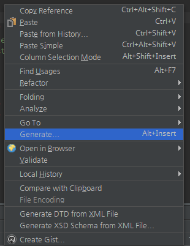

Install
=======
1. settings>plugins

1. select file  

1. restart android studio

Setting
=======
1. code setting

1. add type
    * Type Name : key (can not overlap)
    * Calss Last Name : Default Class Last Name 
        ex> Last Name is 'Activity' -> XXXXActivity
    * File Type : select file type.    
      

TAG INFO 
========
* Common File Type 
    >+ $PACKAGE : pakage name 
        ex> com.xx.xx
        
    >+ $CLASSNAME : class name

* Select File Type 'XML'

    >+ $IMPORTS : import list
        ex> 
        import android.support.v7.widget.RecyclerView;
        import android.view.View;
        import android.widget.ImageView;
        .....

    >+ $MEMBER_VARIABLE : member variable
        ex> 
        private RecyclerView        rcvList;
        private ImageView           ivImg;
        .....

    >+ $LAYOUT_ID : layout id
        ex> R.layout.xxxx
        
    >+ $FIND_VIEW : find view source
        ex> 
        txTxt = (TextView)findViewById(R.id.tvText);
        ivImg = (ImageView)findViewById(R.id.ivImg);
        ....
        
    >+ $FIND_VIEW(+) : find view source.   
        ex> $FIND_VIEW(layoutView)
        txTxt = (TextView)layoutView.findViewById(R.id.tvText);
        ivImg = (ImageView)layoutView.findViewById(R.id.ivImg);
        ....
        

* Select File Type 'JAVA'
    >+ $TAGET_CLASSNAME : Select File Class Name

Excute
======

* Action (Xml or Java)
    + Alt + Insert  
        
    + mouse left button click   
         => 

* Make File Dialog  
    
    + select package  
        
